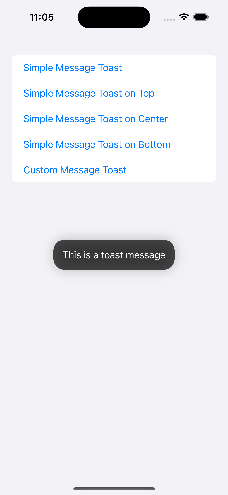
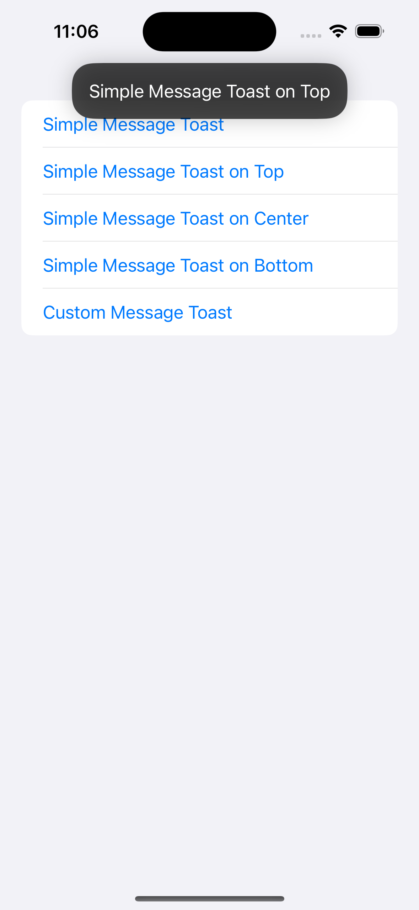
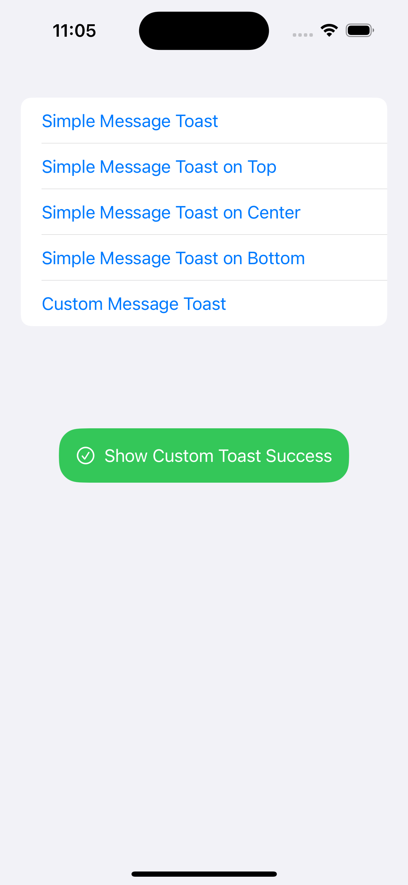

# EasyToast

[](https://github.com/banghuazhao/EasyToast/releases)
[](LICENSE)
[](https://swiftpackageindex.com/banghuazhao/EasyToast)
[](https://swiftpackageindex.com/banghuazhao/EasyToast)

## Introduction

**EasyToast** is a lightweight and customizable SwiftUI package that provides easy-to-use toast notifications. Display brief messages to your users with minimal effort.


## ✨ Features

- **Simple Text Toasts**: Display a quick message to the user with just a few lines of code.
- **Flexible Positioning**: Position the toast at the top, center, or bottom of the screen.
- **Configurable Duration**: Control how long the toast remains visible.
- **Customizable appearance**: Control background color, text color, corner radius, font, padding, shadow, and text alignment
- **Predefined toast types**: Use built-in styles like .success, .error, .warning, and .info.
- **Interactive toasts**: User can create an `onTap` closure to add custom behavior when the toast is tapped.
- **Custom Toast Views**: Create and display fully custom-designed toast notifications.
- **Toast queueing**: Working in progress 🔨
- **Improved animations**: Working in progress 🔨
- **Accessibility support**: Working in progress 🔨

## 🧳 Requirements

- iOS >= 15.0
- Swift >= 5.9

## 💻 Installation

### Swift Package Manager

You can add EasyToast to your project using [Swift Package Manager](https://swift.org/package-manager/).

1. Open your project in Xcode.
2. Go to `File > Add Packages Dependencies...`
3. Enter the package URL: https://github.com/banghuazhao/EasyToast
3. Choose the latest release

Alternatively, add the following to your `Package.swift` file:
```swift
dependencies: [
    .package(url: "https://github.com/banghuazhao/EasyToast.git", from: "0.1")
]
```

## 🛠 Usage

### Quick Start

To display a simple toast with a message, use the `easyToast` modifier:

```swift
import EasyToast

struct ContentView: View {
    @State private var showToast = false

    var body: some View {
        content
            .easyToast(isPresented: $showToast, message: "Hello, EasyToast!")
    }
}
```



### Displaying a Simple Toast on Top

To display a simple toast with a message, use the `easyToast` modifier:

```swift
var body: some View {
    content
        .easyToast(isPresented: $showToast, message: "This is a toast message on top", position: .top)
}
```



### Customization

Customize the appearance and behavior:

```swift
let customStyle = ToastStyle(
    backgroundColor: .blue,
    textColor: .white,
    font: .headline,
    cornerRadius: 12,
    shadow: .gray,
    padding: EdgeInsets(top: 16, leading: 16, bottom: 16, trailing: 16)
)

Text("Custom Toast")
    .easyToast(
        isPresented: $showToast,
        message: "This is a custom toast message.",
        position: .bottom,
        duration: 3
        style: customStyle
    )

```

### Displaying a Custom Toast

To display a custom-designed toast view, use the `easyToast` modifier with a custom view:

```swift
var body: some View {
    content
        .customToast(isPresented: $showToast, duration: 3, position: .bottom) {
            HStack {
                Image(systemName: "checkmark.circle")
                    .foregroundColor(.white)
                Text("Show Custom Toast Success")
                    .foregroundColor(.white)
            }
            .padding()
            .background(Color.green)
            .cornerRadius(20)
        }
}
```



## 💡 Idea

The toast is implemented by overlaying a custom view on top of the view that applies the `.easyToast` modifier, ensuring it seamlessly appears over the current content without disrupting the underlying layout

## License
EasyToast is released under the MIT License. See LICENSE for details.
