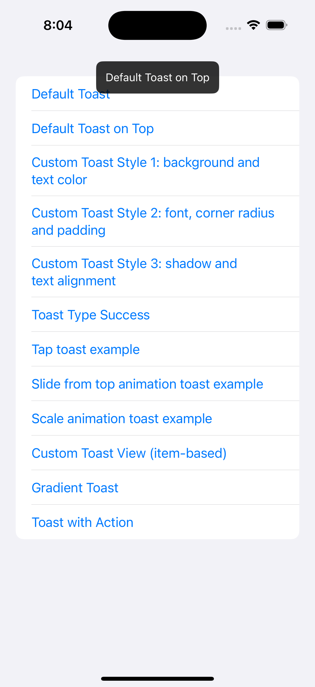
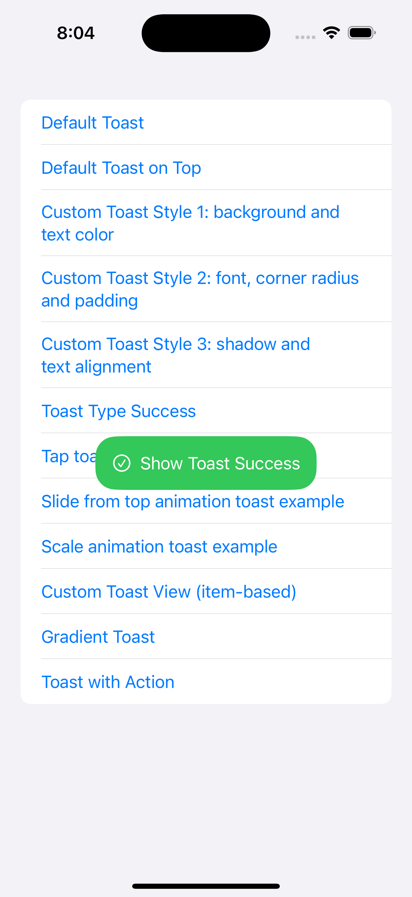
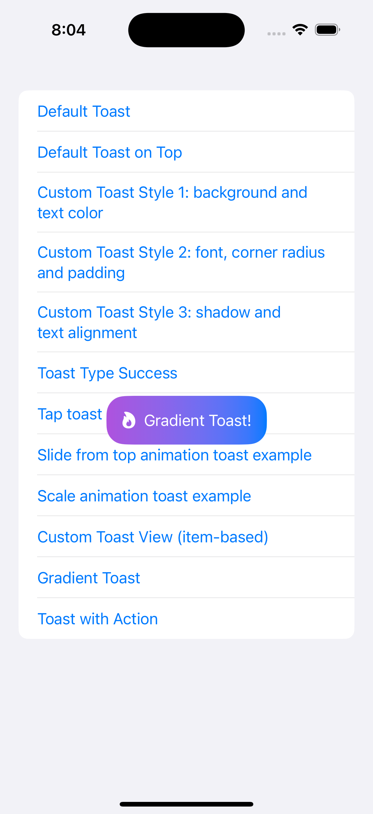

# EasyToast

> **A lightweight, customizable SwiftUI toast notification library for iOS and macOS.**

[](https://github.com/banghuazhao/EasyToast/releases)
[](LICENSE)
[](https://swiftpackageindex.com/banghuazhao/EasyToast)
[](https://swiftpackageindex.com/banghuazhao/EasyToast)

## 📸 Screenshots

<p align="center">
  
  
  
</p>

---

## 📚 Table of Contents

- [EasyToast](#easytoast)
  - [📸 Screenshots](#-screenshots)
  - [📚 Table of Contents](#-table-of-contents)
  - [✨ Features](#-features)
  - [❓ Why EasyToast?](#-why-easytoast)
  - [💻 Installation](#-installation)
    - [Swift Package Manager](#swift-package-manager)
  - [🚀 Getting Started](#-getting-started)
  - [🛠 Usage](#-usage)
    - [Simple Toast](#simple-toast)
    - [Toast on Top](#toast-on-top)
    - [Customization](#customization)
    - [Predefined Types](#predefined-types)
  - [🍭 Item-based \& Custom Toasts](#-item-based--custom-toasts)
    - [Item-based Toast](#item-based-toast)
    - [Advanced Custom Toasts](#advanced-custom-toasts)
  - [🕰️ Backward Compatibility](#️-backward-compatibility)
  - [License](#license)

---

## ✨ Features

- **Simple Text Toasts**: Display a quick message to the user with just a few lines of code.
- **Flexible Positioning**: Position the toast at the top, center, or bottom of the screen.
- **Configurable Duration**: Control how long the toast remains visible.
- **Customizable Appearance**: Background color, text color, corner radius, font, padding, shadow, and text alignment.
- **Predefined Toast Types**: Use built-in styles like `.success`, `.error`, `.warning`, and `.info`.
- **Interactive Toasts**: Add custom behavior when the toast is tapped.
- **Custom Toast Views**: Display fully custom-designed toast notifications.
- **Item-based Toasts**: Show a toast for any optional item, with a custom view for each value.
- **Swift Package Manager Support**: Easy integration into your project.

---

## ❓ Why EasyToast?

EasyToast is designed for SwiftUI developers who want a simple, flexible, and modern way to show toast notifications. It supports both quick messages and fully custom views, with smooth animations and easy configuration.

---

## 💻 Installation

### Swift Package Manager

Add EasyToast to your project:

```swift
.package(url: "https://github.com/banghuazhao/EasyToast.git", from: "0.5.0")
```

Or use Xcode:  
`File > Add Packages...` and enter the repo URL.

---

## 🚀 Getting Started

```swift
import EasyToast

struct ContentView: View {
    @State private var showToast = false

    var body: some View {
        VStack {
            Button("Show Toast") { showToast = true }
        }
        .toast(isPresented: $showToast, message: "Hello, EasyToast!")
    }
}
```

---

## 🛠 Usage

### Simple Toast

```swift
.toast(isPresented: $showToast, message: "This is a toast message!")
```

### Toast on Top

```swift
.toast(isPresented: $showToast, message: "On Top", position: .top)
```

### Customization

```swift
.toast(
    isPresented: $showToast,
    message: "Custom Style",
    style: ToastStyle(backgroundColor: .blue, textColor: .white)
)
```

### Predefined Types

```swift
.toast(isPresented: $showToast, message: "Success!", type: .success)
```

---

## 🍭 Item-based & Custom Toasts

### Item-based Toast

```swift
@State var selectedToast: String? = nil

Button("Show Custom Toast") { selectedToast = "Custom Toast!" }

.toast(item: $selectedToast) { value in
    HStack {
        Image(systemName: "checkmark.circle").foregroundColor(.white)
        Text(value).foregroundColor(.white)
    }
    .padding()
    .background(Color.green)
    .cornerRadius(20)
}
```

### Advanced Custom Toasts

**Gradient Toast:**
```swift
.toast(item: $selectedGradientToast) { value in
    HStack {
        Image(systemName: "flame.fill").foregroundColor(.white)
        Text(value).foregroundColor(.white)
    }
    .padding()
    .background(
        LinearGradient(
            gradient: Gradient(colors: [.purple, .blue]),
            startPoint: .leading,
            endPoint: .trailing
        )
    )
    .cornerRadius(20)
}
```

**Toast with Action:**
```swift
.toast(item: $selectedActionToast, duration: 5) {
    selectedActionToast = nil
} content: { value in
    HStack {
        Image(systemName: "arrow.uturn.left").foregroundColor(.white)
        Text(value).foregroundColor(.white)
        Spacer()
        Text("Undo").bold().foregroundColor(.yellow)
    }
    .padding()
    .background(Color.orange)
    .cornerRadius(20)
}
```

---

## 🕰️ Backward Compatibility

`.easyToast` is still available for backward compatibility, but is deprecated. Please migrate to `.toast` and `.toast(item:)` for new code.

---

## License

EasyToast is released under the MIT License. See LICENSE for details.

---

**Keywords:** SwiftUI toast, toast notification, custom toast, iOS, macOS, Swift Package Manager, SPM, SwiftUI library
